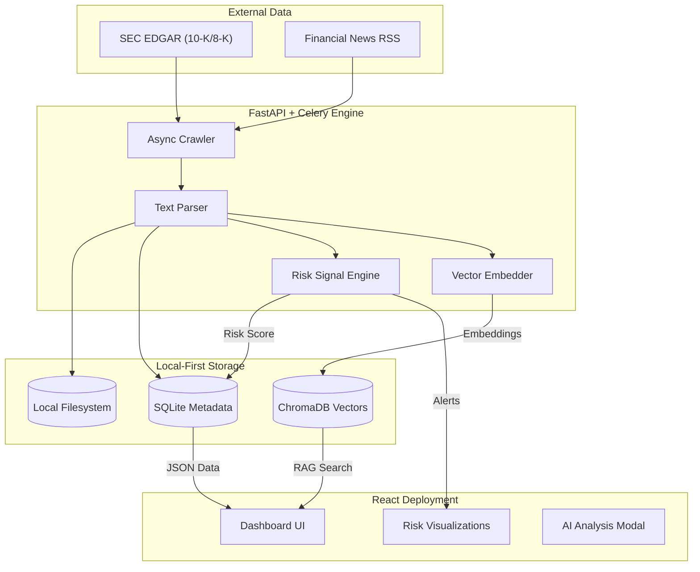

# 🚨 FINCRAWL — Autonomous Financial Filings Early-Warning System

**AI-powered risk detection from SEC filings, corporate disclosures, and financial news.**

FINCRAWL is an autonomous financial intelligence platform that continuously ingests SEC EDGAR filings and news streams, processes them with RAG (Retrieval-Augmented Generation), and detects high-risk signals such as going-concern warnings, material weaknesses, accounting anomalies, distress clues, and fraud indicators.

Designed as a hackathon-ready MVP, FINCRAWL combines intelligent ingestion, semantic search, automated reasoning, and real-time dashboards — enabling analysts, investors, auditors, and regulators to understand emerging risks before markets react.

## ✨ Key Features

### ⚙️ Autonomous Ingestion Pipeline
- Crawls SEC EDGAR filings (10-K, 10-Q, 8-K).
- Monitors RSS financial news feeds in real time.
- Extracts text from HTML/PDF filings.
- Normalizes documents into structured JSON.

### 🔍 Semantic RAG Engine
- Embeds filings using SentenceTransformers.
- Stores vectors in ChromaDB for fast similarity search.
- Provides source-grounded, citation-backed answers using a lightweight RAG pipeline.

### 🚨 Risk Scoring & Event Detection
- **Detects red-flag patterns including:**
  - “Going concern” remarks
  - “Material weakness in internal controls”
  - Executive resignations
  - Litigation disclosures
  - Sudden financial restatements
  - Negative sentiment shifts
  - Bankruptcy precursors
- **Scores are produced by a hybrid engine:**
  - Rule-based heuristics
  - Pattern classifiers
  - Semantic similarity to known risk templates

### 📊 Premium Interactive Dashboard
- **Bloomberg-Style Dark Mode Interface**: Premium glassmorphism design for high-contrast professional use.
- **AI Risk Analysis Modal**: Click "Analyze" to get an instant, explanation of the risk score (Critical/Warning/Stable) and detected signals.
- **Live Risk Feed**: Real-time streaming of risk scores with "Refresh to Crawl" capability.
- **Visualizations**: Risk distribution and volatility metrics.
- **Deep-Links**: Direct access to source filings for verification.

## 🏗️ Architecture Overview



## 🧰 Tech Stack

- **Backend**: Python 3.10+, FastAPI, Celery (async workers), ChromaDB (vector store), SQLite, SentenceTransformers
- **Frontend**: React + Vite, TailwindCSS, Recharts
- **Infrastructure**: Local development (No Docker needed), Makefile-based orchestration, Lightweight deployment

## 🚀 Quick Start

### 1️⃣ Clone the Repository
```bash
git clone https://github.com/Tejasv-Singh/FINCRAWL
cd FINCRAWL
```

### 2️⃣ Backend Setup
```bash
python3 -m venv venv
source venv/bin/activate
pip install -r backend/requirements.txt
```

Run backend:
```bash
make run-backend
```
Backend runs at → `http://localhost:8001`

### 3️⃣ Frontend Setup
```bash
cd frontend
npm install
npm run dev
```
Frontend runs at → `http://localhost:5173`

### 4️⃣ Start Full System
```bash
make run-all
```
This launches:
- FastAPI backend
- RAG engine
- React dashboard

## 🚀 Deployment

### Backend (Render)
Click below to deploy the Backend + Worker + Database to Render.com (Auto-configured).

[](https://render.com/deploy?repo=https://github.com/Tejasv-Singh/FINCRAWL)

### Frontend (GitHub Pages)
The Repository enables `GitHub Pages` automatically via GitHub Actions.
1. Go to Repo Settings -> Pages -> Source: `GitHub Actions`.
2. The dashboard will be live at `https://tejasv-singh.github.io/fin_crawl/`.
3. **Important**: You must configure the Frontend to talk to the Backend.
   - Go to Repo Settings -> Secrets and variables -> Actions -> New Repository Variable.
   - Name: `VITE_API_URL`
   - Value: `https://your-render-backend-url.onrender.com/api/v1` (Get this from Render Dashboard).

## 📑 Data Ingestion

To manually trigger document ingestion:
```bash
make crawl
```
This supports SEC EDGAR RSS feeds and Company filings (10-K, 8-K).

## 🧪 Backtesting

Evaluate the risk-scoring engine against historical filings:
```bash
make backtest
```
Outputs: Precision/Recall and Risk validation status.

## 📂 Project Structure

```bash
FINCRAWL/
│
├── backend/
│   ├── app/
│   │   ├── api/          # FastAPI routes
│   │   ├── crawlers/     # SEC EDGAR + RSS crawlers
│   │   ├── parsers/      # Parsing logic
│   │   ├── services/     # Scoring, Alerting, VectorDB
│   │   ├── worker/       # Celery tasks
│   │   └── db/           # Database models
│   └── requirements.txt
│
├── frontend/
│   ├── src/
│   │   ├── components/   # UI components
│   │   └── App.tsx       # Main view
│   └── package.json
│
├── scripts/
│   └── backtest_scoring.py
│
├── Makefile
└── README.md
```

## 🧠 Roadmap (Post-Hackathon)
- [ ] Whisper-powered earnings call transcription
- [ ] Advanced anomaly detection (Autoencoders, BERT-based classifiers)
- [ ] Multi-jurisdiction filings (SEBI, FCA, ASX)
- [ ] Real-time alert system (Slack/Email)
- [ ] Multi-agent “Analyst Copilot”
- [ ] Full company knowledge graph
- [ ] Sentiment delta modeling

## ❤️ Acknowledgements
FINCRAWL was built for **SNOW FEST Hackathon 2025**, with the mission of democratizing financial risk intelligence.

## 📬 Contact
- **Developer**: Tejasv Singh
- **GitHub**: [https://github.com/Tejasv-Singh](https://github.com/Tejasv-Singh)
